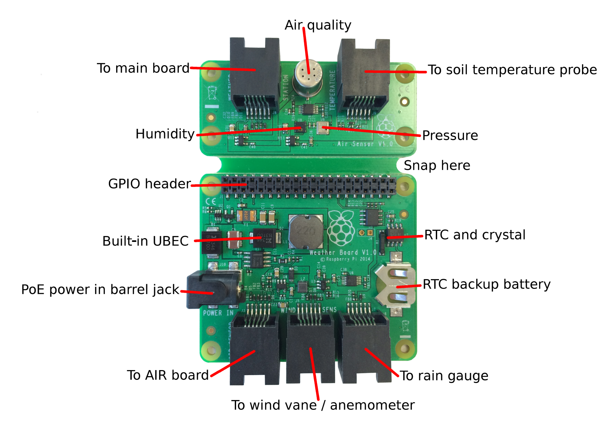

# Raspberry Pi weather station

The Weather Station kit is a HAT for the Raspberry Pi which allows it to collect weather data using a variety of sensors. It is designed to be used in schools to enable students to create their own weather station, and has a range of resources to support its use.

As well as logging data locally, schools that received a free Weather Station can log their data in a central Oracle database, so they can share information and collaborate with schools around the world.

## How to set up your Weather Station

1. [Register your Weather Station](register.md)
1. [Put the kit together part I](build.md)
1. [Set up the software](software.md)
1. [Put the kit together part II](build2.md)
1. [Testing your Weather Station](test.md)
1. [Install the Weather Station outside](siting.md)

## Resources

- [Sensing the weather](https://github.com/raspberrypilearning/sensing-the-weather): a series of cross-curricular lessons exploring measuring, collecting, and analysing weather data in order to predict the weather.
- [Weather station web page](https://www.raspberrypi.org/weather-station)
- Get support (or show off your Weather Station!) on [our forum](https://www.raspberrypi.org/forums/viewforum.php?f=112).

