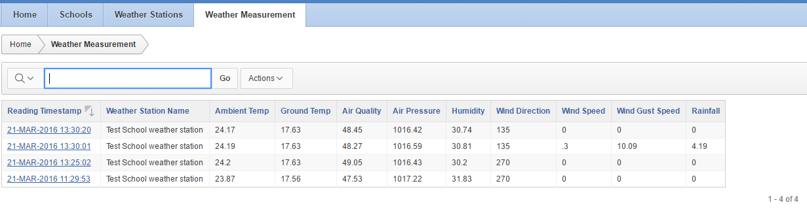

# Using the weather station disk image

The easiest way to get your Raspberry Pi Oracle weather station up and running is to use the pre-built disk image.

## Download and write the image to the SD card

1.	[Download the disk image](http://downloads.raspberrypi.org/weather_station/images/weather_station-2016-03-24/WeatherStation.zip).

1.	Follow [the instructions](https://www.raspberrypi.org/documentation/installation/installing-images/README.md) for writing it to the SD card that came with the weather station (or any other SD card that is at least 8Gb).

1.	Put the SD card into the Raspberry Pi in your weather station and power it up.

## A bit of housekeeping

The Pi will boot to a text prompt:

1. Login with `user` pi and password `raspberry`.

1. Run the configuration tool:

`sudo raspi-config`

1. Select option 1 `Expand Filesystem`.

1. Select `Finish`.

1. Select `No` when asked to reboot.

1. It's a good idea to **change your password** while you're here. Select option 2 `Change User Password`. This is the password you will need to log into your Raspberry Pi as user 'pi'.


## Make the weather station run at boot and log data automatically

1. Go to the WeatherStation folder:

    `cd WeatherStation` 

1. Set up the scheduled (cron) job:

    `crontab WeatherStation.cron`  

## Check that the time is correct

1. Check date and time:

    `date`

1. If the date is wrong, fix it:

     `sudo date -s 'yyy-mm-dd hhh:mm:ss'` 

For example, to set the date and time to 24th March 2016 12:24:56, type the following:

     `sudo date -s '2016-03-24 12:34:56'`

  
1. Finally, reboot

    `sudo reboot`

## Set up your weather station to upload to the Oracle Apex database

At this stage, you have a weather station that reads its sensors and stores the data at regular intervals in a database on the SD card. But what if the SD card gets corrupted? How do you backup your data? And how do you share it with the rest of the world?

Oracle has set up a central database to allow all schools in the Weather Station project to upload their data. It's safe there and you can download it in various formats, share it, and even create graphs and reports. Here's how to do it.

## Register your school

Firstly, you'll need to [register your school](oracle.md) and add your weather station. Come back here when you have your weather station passcode.

<a name="credimage"></a>

## Update credential files with your weather station details

This is the one thing we couldn't put in the disk image: your weather station name and password from when you [registered with Oracle's Apex database](). You have to put these manually into the credentials file as follows:


1. Go to your home directory:

    `cd ~`

1. Edit the credentials file using the nano editor:

    `nano credentials.json`

Change the lines: 

``` java
{
    mysql : { host : "localhost", user : "pi", pass: "raspberry", database : "weather" }
}
```

to:

``` java
{
    mysql : { host : "localhost", user : "pi", pass: "raspberry", database : "weather" },
    cloud : { url : "https://apex.oracle.com/pls/apex/raspberrypi/weatherstation/submitmeasurement",
              user: "MyStation", pass: "MyPass"}
}
```

**Double-check curly braces and commas are in the right place!**


Change **MyStation** and **MyPass** to your weather station name and passcode. Make sure you type them in exactly, as they are case-sensitive.


1. Save the file with `CTRL-O`, and press `Enter` then `CTRL-X` to quit nano.
 
## Check that it's working

### Local database and logging

1. Log into the database [password: tiger]:

    `mysql -u root -p weather` 

1. Run the SQL command `SELECT CREATED, LEVEL, TEXT FROM LOG ORDER BY CREATED;`

1. Expected result: 

### Oracle remote database

1. Log into your school's [Oracle database account](oracle.md).

1. Go to 'Weather measurements'. You should see the station readings. The database logs every 10 minutes locally, and uploads to Oracle once per hour. If no readings are showing, check back a little later.




You can download your data in various formats and also make charts using the menu:


