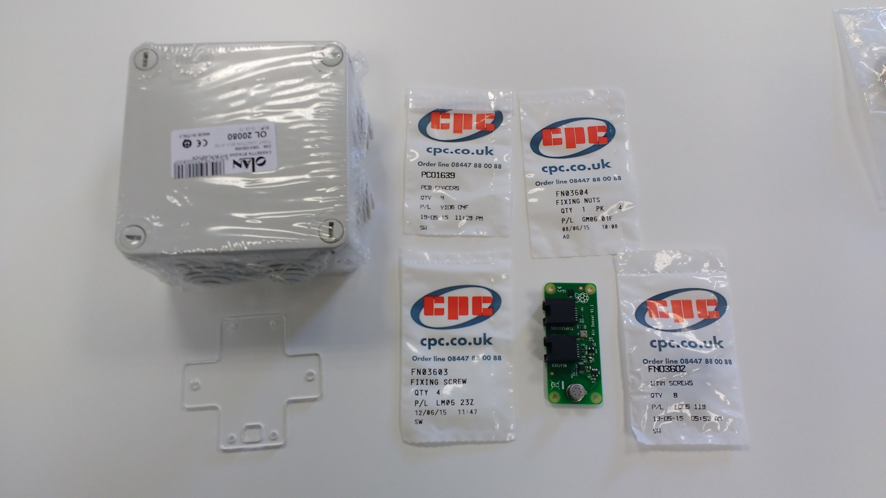
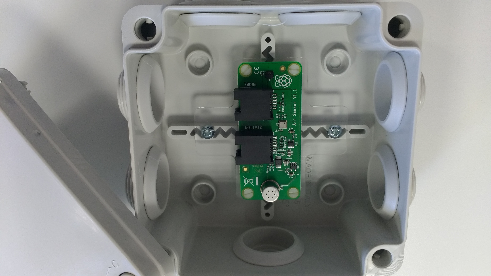
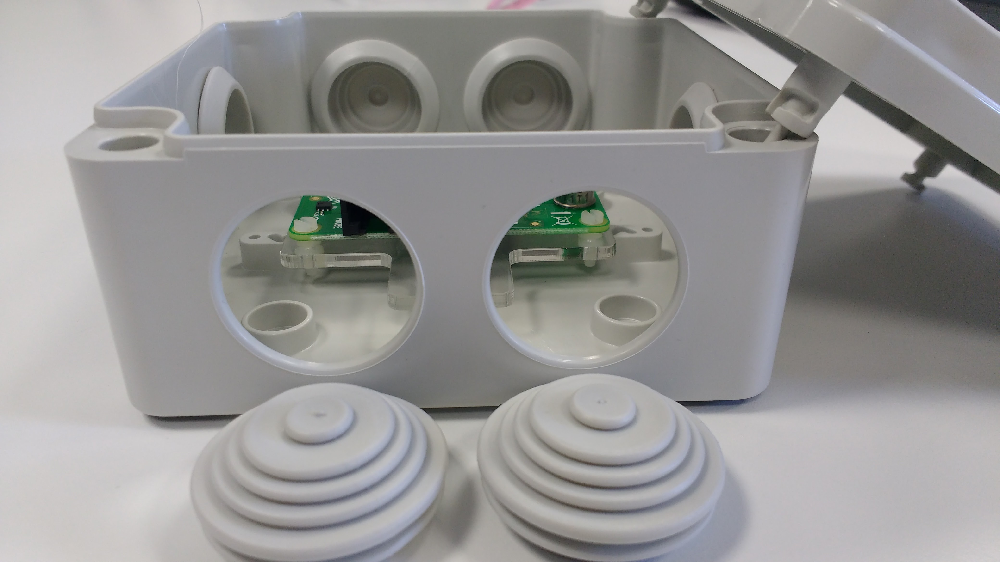
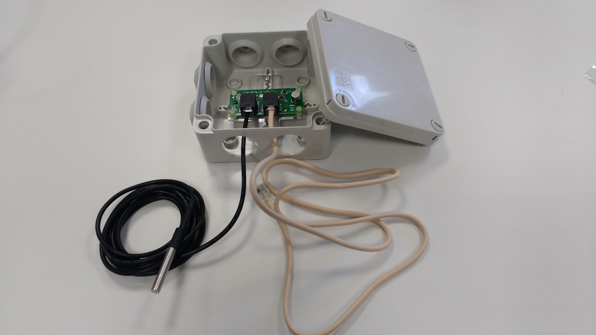
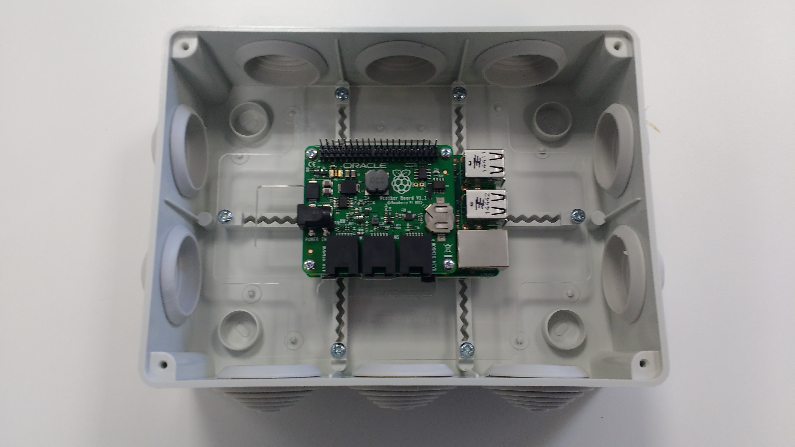
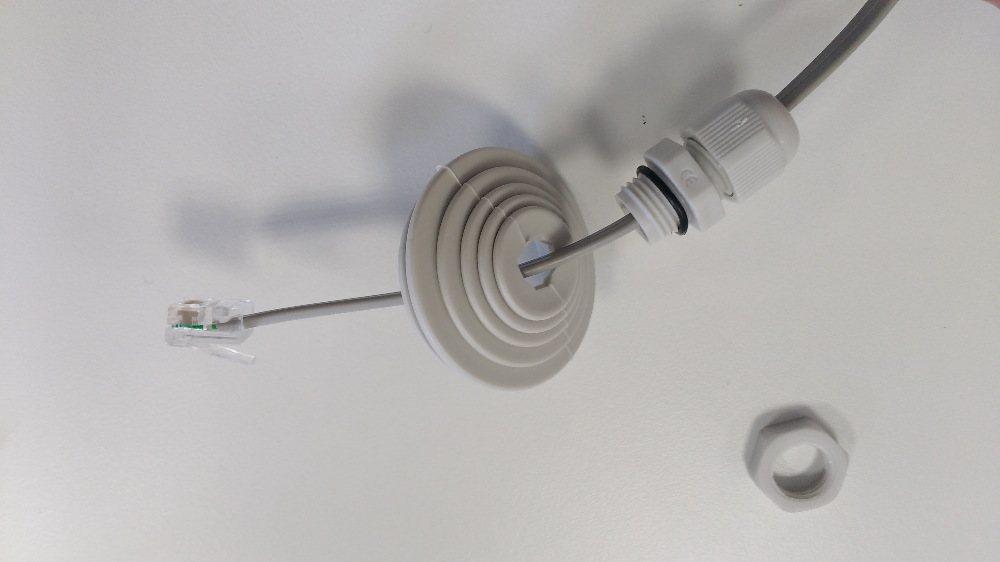
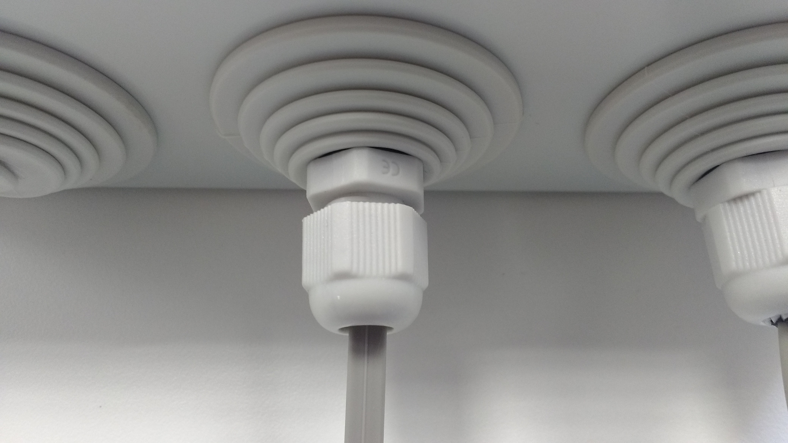
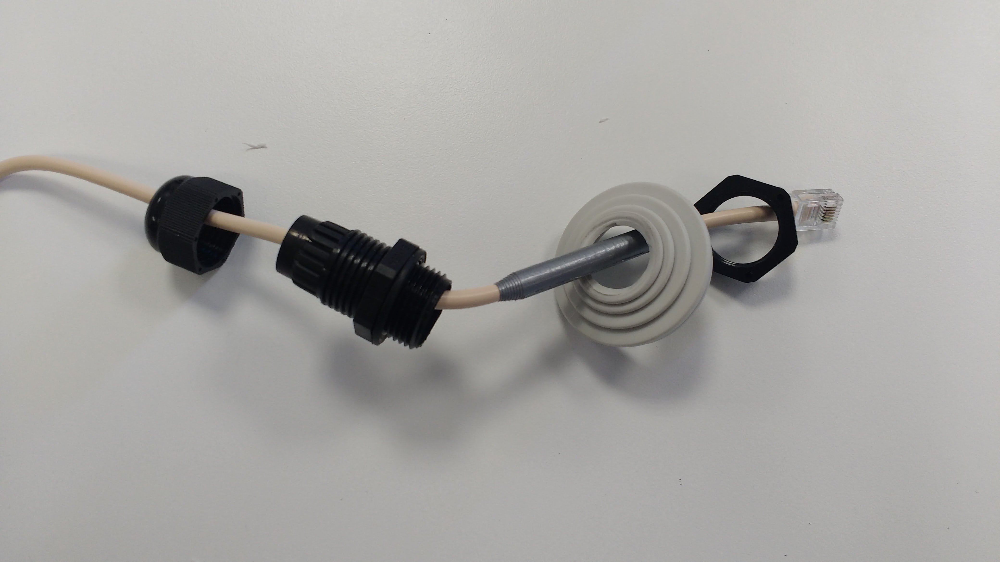
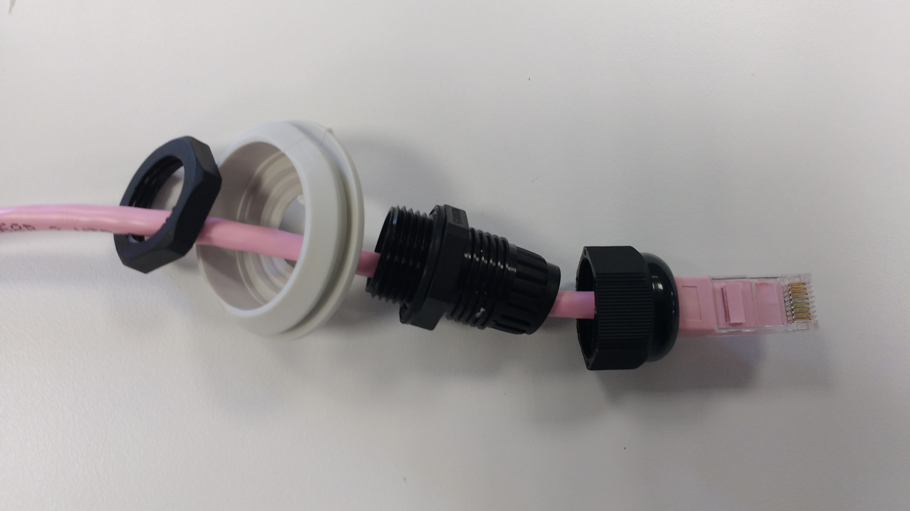

# Building your Weather Station Part II
## Setting up the Air Sensor board
1. You'll need the following parts to set up the Weather Station sensors.
   
   
   
1. Take the air sensor board and place it on its acrylic base.

	
	
1. Use the fixing screws, fixing nuts, and the PCB spacers to affix the board to the base.

	
	
1. The air sensor board can now be mounted in its container using the 10mm screws.

	

1. Remove the grommets from the housing on the side of the board with the exposed sockets.

	
	
1. Attach the soil temperature sensor's RJ11 and the loose RJ11 to the board as shown below.

	
		

1. You can now secure the lid of the box. Do not try and place the grommets back into the box. The sensors on the board need to be able to have air flowing around them.

## Setting up the other sensors

1. Take the larger container and your mounted Raspberry Pi, with all cables removed.

	

1. Affix the base to the container using the remaining 10mm screws.

	
	
1. Remove the three grommets from the side of the box opposite the three ports. Using a sharp knife or scalpel, remove the first of the small circles from one of the grommets.

	
	
1. The rain gauge has an attached RJ11 with a water-tight fixing assembly on the end. Remove the plastic nut from the fixing assembly.

	
	
1. Thread the RJ11 cable through the hole you have made in the grommet, as shown below. Make sure the grommet is the correct way around.

	
	
1. Then thread the plastic nut over the end of the RJ11 cable.

	
	
1. Screw the plastic nut firmly to the fixing assembly.

	
	
1. You can now connect the anemometer to the weather vane.

	
	
1. Repeat the above steps for attaching the fixing assembly around the grommet. 
	
1. Place both of the grommets back into the housing, and tighten the fixing assemblies so that they form a seal around the RJ11 cables.

	
	
1. The RJ11 cable that runs from the air sensor board uses one of the large black plastic fixing assemblies included in the kit. Disassemble the assembly.

	
	
1. Cut the third grommet, removing two of the rubber circles.

	
	
1. As the fixing assembly is a little large for the RJ11 cable, wrap the end of the cable with a little duct tape or electrician's tape.

	
	
1. Place the fixing assembly and grommet over the RJ11 cable as shown. 

	
	
1. As you did before, tighten the assembly around the cable and place the grommet back into the housing.

	
	
1. Remove a grommet from the side of the housing opposite the Raspberry Pi's Ethernet port. Cut two circles from the grommet and then thread it over your Ethernet cable (not included) along with a large fixing assembly. You may find the Ethernet cable hard to fit through the fixing. If so, you can carefully trim material from the sides of the Ethernet cable with a sharp scalpel until it will fit through, being careful not to cut any of the cables. 

	
	
1. Place the grommet back into the housing, then attach the PoE adaptor. All the cables can now be plugged into their labelled ports.

	
	
1. You can remove some more grommets at this point, and plug in an HDMI cable, mouse, and keyboard. This will allow you to install the software, if you have not done so already, or test that the software is working.

	
	
## What Next?
1. If you have not yet set up the software, then head on over to the [Software Guide](software.md), to configure the Weather Station. If you have done this already, then you can proceed to [Testing your Weather Station](test.md).
