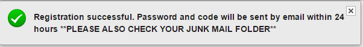
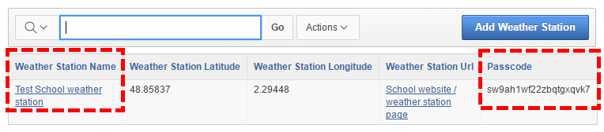

# Publishing weather data with Oracle

One of the big ideas with the weather station is to allow users to upload their data to a shared Oracle database. Schools data can then compare their data with other schools and carry out comparisons, test hypotheses and get a bigger picture of global weather. It's also the easiest way to visualise your data using graphing tools and to download it in various formats and reports.

## Register for an Oracle Apex database account
### Register

Go [here to register](https://apex.oracle.com/pls/apex/f?p=84942:LOGIN_DESKTOP:9427101834476:&tz=0:00)
  

**Do not fill in any details.** Just click on the "Register" button. On the next screen fill in your details. Contactable means you are happy to be contacted by other schools as part of the project.

Hit "Register" top right. You will see:

----------
  
> **IMPORTANT: Registrations are validated manually and may take up to 24 hours depending on your time zone**

----------

If you have been waiting more than 24 hours please first check your junk mail folder and then contact weather@raspberrypi.org.

The activation email will contain a password and a verification code. 

###Log in

Log in using your **school name** (as entered in the registration form) for the Username and the password from the email. 

You will be prompted for the verification code from the email when logging in for the first time.

###Edit your school details
You should change your password to something more memorable. Click on your school name and then "Edit" to change your details.

##Add your weather station
  
Weather stations tab --> Add Weather Station

The *latitude* and *longitude* of the weather station will be required for this. There are lots of websites such as [www.latlong.net](www.latlong.net) that will do this. Once you have created a weather station it will be given a password. You will need this in the next step to connect to the Oracle database. 

##Next steps
Now you have the weather station passcode you can set it up to upload data to the Oracle database.

If you used the disk image [go here](disk-image.md#credimage)
If you set up the weather station manually [go here](software-setup.md#credmanual)

  
  
