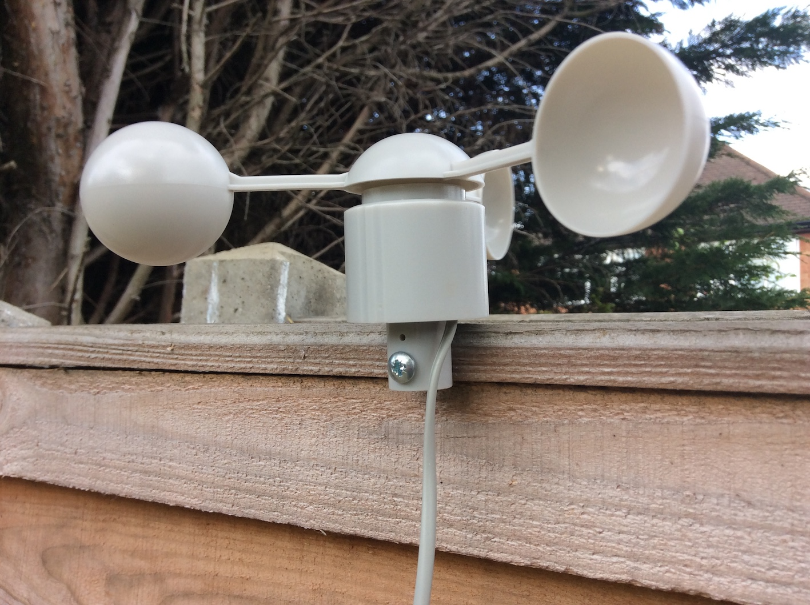
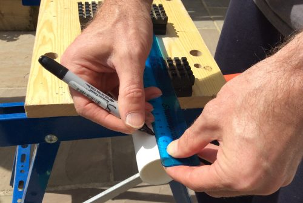
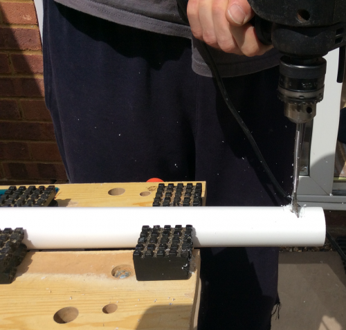
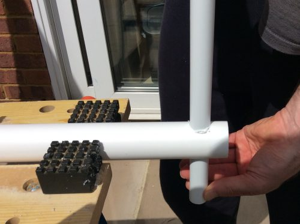
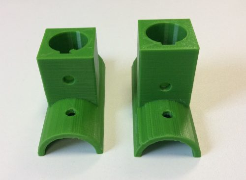
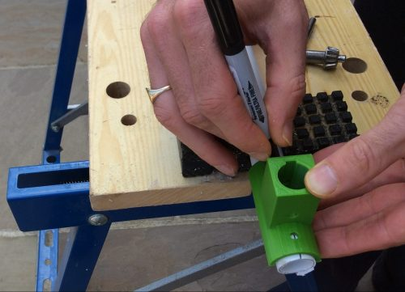
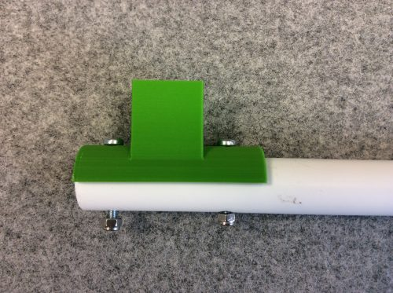
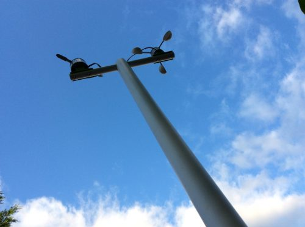

# Installing your Weather Station outside Part I: Wind sensors

We've made our weather station easy to assemble and get up and running, but we know that the trickiest part of setting it up can be installing the equipment outdoors. Since every set-up location is different, it is impossible to create a guide to exactly suit everyone. However, this guide is intended to provide some helpful instructions that you can hopefully adapt to meet your particular needs.

## From where the wind blows

This guide focusses on the wind sensors. The weather station kit comes with a weather vane for measuring wind direction and an anemometer to record wind strength. Both of these are connected to the Pi via fairly long cables, so you needn't be constrained by having to fix them close to the box containing the hardware.

   

 A really simple way to mount the wind sensors is to screw them to the edge of a wooden fence or roof. As long as the scoops can spin freely, you will be able to record wind readings, although you may need to adjust your measurements to compensate for the effects of being so close to the flat roof itself. Working out the best way to measure the required adjustment can be an interesting experiment in itself!

##  High (but not dry)

Positioning the instruments a little higher can be cheap and easy: all you need are some readily available plumbing spares from the hardware store to build a mast. Standard polypropylene waste pipes are light, strong, and easy to work with. Even better, a typical 3m length of 40mm diameter pipe is just right for the cables that come with our kits, and a common 22mm diameter pipe is great for mounting the sensors. Of course you don't have to use the full length of pipe if you don't need to.

1. Here's how to make a simple T-shaped mast.

   

2. Measure and mark out a spot approximately 3cm from one end of the 40mm pipe. Clamp the pipe securely in a vice or work bench and then drill a 22mm hole all the way through. Sand off the loose fibres from around the hole.

   

3. Then cut a 30cm length of the 22mm diameter pipe. Simply slide this through the hole in the wider pipe and voila! You've made your T-shaped mast!

   

## Mounting the sensors

4. To attach the weather vane and anemometer to the mast, drill two 5mm diameter holes through the narrower pipe (one at each end) and use a nut and bolt to affix the sensors. Alternatively, if you have access to a 3D printer, you can manufacture some brackets to fix the vane and anemometer even more securely. Either download the [STL files](https://www.thingiverse.com/thing:2360682) for these brackets, or design some yourself!

   
   

5. Before final assembly, thread the sensor cables up through the wider pipe to stop them flapping around in strong gusts.

   

## Mast ahoy!

6. Another great thing about plumbing pipes is that there are plenty of cheap mounting brackets available to help affix your mast to any surface or wall. The side of a wooden shed or hut is ideal but you can also attach the mast to the brickwork of a building.

   

7. Once everything is ready, connect the sensors to the main weather station board and test that they are working correctly. It is much easier to adjust a loose cable before hoisting the mast into position! Use cable ties to keep the last few centimetres of cables under control where they emerge from the pipe. This will also provide a 'safety line' for the sensors themselves, should the mounting brackets break (remember that common 3D printing materials have a limited lifespan when exposed to the elements and may require replacing from time to time).

   

## What Next?

If you haven't worked out how to connect your weather station to a network, why not have a look at at our [guide to using your kit with wifi](outside2.md)?

Or how about tackling some of our Weather Station resources on [raspberrypi.org](https://raspberrypi.org) to learn how to access the Oracle Database and play with data from around the world.
- [Fetching the Weather](https://www.raspberrypi.org/learning/fetching-the-weather/)
- [Graphing the Weather](https://www.raspberrypi.org/learning/graphing-the-weather/)
- [Mapping the Weather](https://www.raspberrypi.org/learning/mapping-the-weather/)
