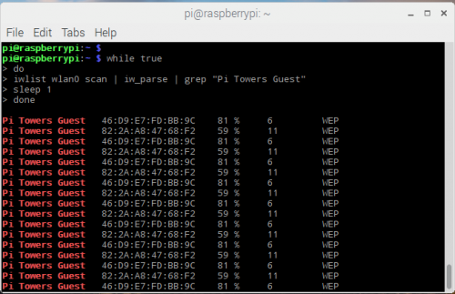
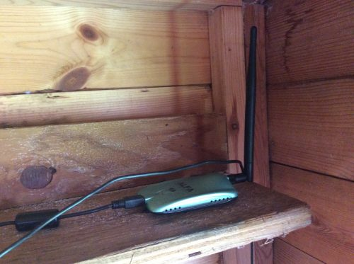

# Installing your Weather Station outside Part II: Using wifi

We've made our weather station easy to assemble and get up and running, but we know that the trickiest part of setting it up can be installing the equipment outdoors. Since every set-up location is different, it is impossible to create a guide to exactly suit everyone. However, this guide is intended to provide some helpful instructions that you can hopefully adapt to meet your particular needs.

This guide focuses on how to connect the weather station kit to a WiFi network so that it can upload its data to online databases.

# Power and internet connectivity

The Raspberry Pi Weather Station kit comes with Power over Ethernet (PoE) adapters so that you can connect it up outside using just one cable.

   

However, there are some situations where you might not need or be able to use a networking cable to reach your weather station.  For example you might site the kit in an outbuilding such as a storage hut of your school's playing field or on some other kind of shed. These can be good locations as they may be far from tall buildings while having their own power.

# Using Wifi

If you cannot use a networking cable, you could periodically retrieve the Weather Station's SD card and upload its data to the Oracle cloud using another Pi.

Alternatively, you can connect your Weather Station to a WiFi network. The Raspberry Pi 2 in the kit doesn't have built-in WiFi, but you can easily add a WiFi USB dongle. In fact, an external wireless device with a large antenna may be better suited for connecting to a network that is some distance away.

   

# Choosing your site

If you're using WiFi, the most important thing is to minimise any obstacles between your Weather Station and the nearest transmitter. Concrete and metal structures are very good at absorbing WiFi signal. Water is also a fairly good absorber - this can be a factor if there are large plants around: absorption may be minimal in dry conditions or in the winter when there are fewer leave, but could rise dramatically after summer rainfall.

# Optimising your position

The exact position of your WiFi dongle can have a large impact on signal strength. Therefore it is worth spending some time trying to find the optimal place for your weather station. You can use the command

 ```bash
 iwlist wlan0 scan
 ```

to display a list of WiFi networks your Pi can see (run this in a Terminal Window). This command produces a lot of information but the important parameter is 'Quality', reported in the third column.


 Remember that  a -60dbm is a better signal that -70dbm, and that decibels relative to a milliwatt (dbm) scale *logarithmically*, so that a 3dbm increase means that the power has doubled.

 It is not very easy or efficient to repeatedly run this command while adjusting the position of the Pi or dongle. Instead we can use some nifty Python code and a shell script to display a continually updating readout of the signal strength picked up from your network.

 First of all, install the Python helper program.

   ```bash
   sudo pip install iw_parse
   ```

 Then to run a continual feed, run this multi-line command in a Terminal window :

 ```bash
   while true
   do
   iwlist wlan0 scan | iw_parse | grep "your ss id"
   sleep 1
   done
```
You will see something like this:

   

 While this output is scrolling, adjust the position of your Weather Station or its external dongle to maximise the 'Quality' value.

# Extending the range

 Positioning the dongle outside of the Weather Station's housing but inside a reasonably watertight hut or shed gives you a lot more options. Having the dongle on a USB 'extender' lead so that it isn't plugged directly into the Pi's USB port can improve signal. A transceiver with an external antenna can also make a big difference. Common transceivers are omnidirectional and look like a familiar stick aerial. This type of antenna can be a good choice in a location with lots of buildings, as you may benefit from reflected signals.

   

 You can also experiment with directional antennae. A small mini-panel can provide large gain but requires more careful adjustment to optimise; due to reflections and other effects, the position with the strongest signal may not always fall on a straight line from the antenna to the transmitter.

 If you're feeling particularly creative you could even [build a 'cantenna'](http://www.turnpoint.net/wireless/cantennahowto.html) - a WiFi antenna using an aluminium food can.

 ## What Next?
 Why not try out some of our Weather Station resources on [raspberrypi.org](https://raspberrypi.org) to learn how to access the Oracle Database and play with data from around the world.
 - [Fetching the Weather](https://www.raspberrypi.org/learning/fetching-the-weather/)
 - [Graphing the Weather](https://www.raspberrypi.org/learning/graphing-the-weather/)
 - [Mapping the Weather](https://www.raspberrypi.org/learning/mapping-the-weather/)
