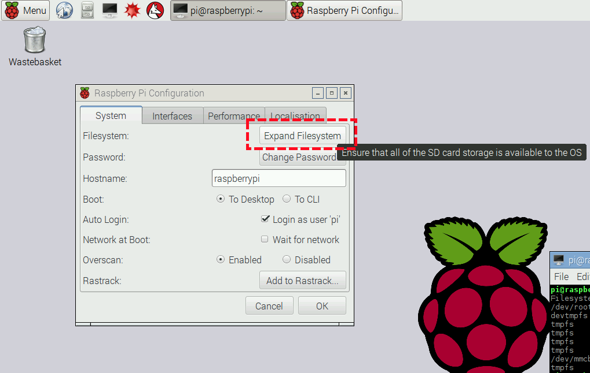
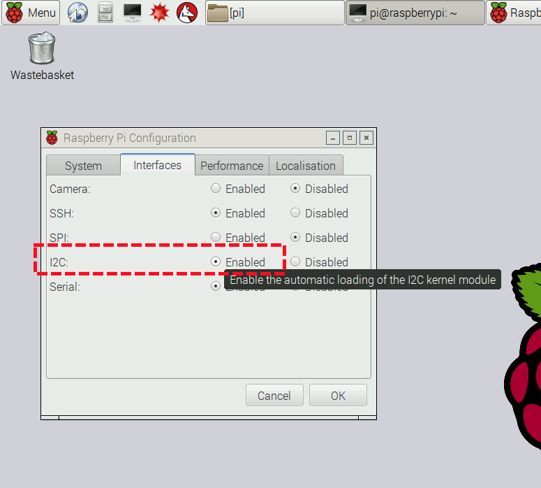
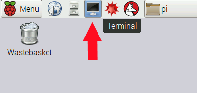
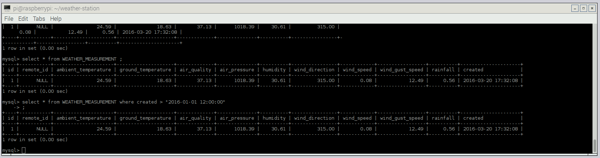

# Setting up the Raspberry Pi Oracle weather station software

You don't need any prior knowledge to set up the weather station. There are several steps, but the benefit of setting up manually is that you'll learn about the workings of the sensors and the station as you do it. You'll also be introduced to the command line interface, the text editor nano and the MySQL database. It's also a great introduction to Linux.

If you just want to get your weather station up and running as quickly as possible, we've made a pre-built [weather station disk image](disk-image.md). 

If you get stuck or need help, please come and talk to us on [our forums](https://www.raspberrypi.org/forums/viewforum.php?f=112).

## Manual installation

1.  Start with a fresh install of the latest version of [Raspbian](https://www.raspberrypi.org/downloads/raspbian/).
1.  When booting for the first time, you will be presented with the desktop.
2.  From the Menu button on the top-left, choose Preferences > Raspberry Pi Configuration.
3.  Select "**Expand Filesystem**":

    
    
1. While you're here, we recommend that you **change your password** using the button underneath.   
1. In the Interfaces tab, enable I2C:

    
    
1. A reboot dialogue will appear. Select "Yes". 

## Setting up the real-time clock

We'll be doing most of the work from the command line. Open a terminal window, using the icon on the menu bar:

    

You'll now be at a prompt:

```
{.bash}pi@raspberrypi: ~ $
```

You can type the commands which follow into this prompt.

First, you'll need to download the necessary files: 

``` {.bash}
cd ~ && git clone https://github.com/raspberrypi/weather-station
```

We've included an install script to set up the real-time clock automatically. You can run this file or, alternatively, follow the instructions below to set up the RTC manually. We recommend using the install script!

### Automatic RTC setup

To run the script, enter the following:

```bash
./weather-station/install.sh
```

This will take some time, so please be patient. At some point, it will ask you to confirm or set the time. When finished, it will reboot automatically.

Skip to the **Testing the Sensors** section below and test that the weather station and all sensors are working. Finally, go to **Database Setup**.


### Manual RTC setup

First, you want to make sure you have all the latest updates for your Raspberry Pi:

``` {.bash}
    sudo apt-get update && sudo apt-get upgrade
```

You now need to make some changes to a config file to allow the Raspberry Pi to use the real-time clock:

``` {.bash}
    sudo nano /boot/config.txt
```

Add the following lines to the bottom of the file:

```{.bash}
dtoverlay=w1-gpio
dtoverlay=pcf8523-rtc
```

Press **Ctrl + O** then **Enter** to save, and **Ctrl + X** to quit nano.

Now set the required modules to load automatically on boot:

``` {.bash}
sudo nano /etc/modules
```

Add the following lines to the bottom of the file:

``` {.bash}
i2c-dev
w1-therm
```

Press **Ctrl + O** then **Enter** to save, and **Ctrl + X** to quit nano.

For the next steps, we need the Weather Station HAT to be connected to the Raspberry Pi:

``` {.bash}
sudo halt
```

Reboot for the changes to take effect:

``` {.bash}
sudo reboot
```

Check that the real-time clock (RTC) appears in `/dev`:

``` {.bash}
ls /dev/rtc*
```

You should see something like `/dev/rtc0`.

### Initialise the RTC with the correct time

Use the `date` command to check the current system time is correct. If it's correct, then you can set the RTC time from the system clock with the following command:

``` {.bash}
sudo hwclock -w
```

If not, then you can set the RTC time manually using the command below (you'll need to change the `--date` parameter, as this example will set the date to the 1st of January 2014 at midnight):

``` {.bash}
sudo hwclock --set --date="yyyy-mm-dd hh:mm:ss" --utc
```

For example:

``` {.bash}
sudo hwclock --set --date="2015-08-24 18:32:00" --utc
```

Then set the system clock from the RTC time:

``` {.bash}
sudo hwclock -s
```

Now you need to enable setting the system clock automatically at boot time. First, edit the rule in `/lib/udev/`:

``` {.bash}
sudo nano /lib/udev/hwclock-set
```

Find the lines at the bottom that read:

``` {.bash}
if [ yes = "$BADYEAR" ] ; then
    /sbin/hwclock --rtc=$dev --systz --badyear
else
    /sbin/hwclock --rtc=$dev --systz
fi
    ```

Change the `--systz` options to `--hctosys` so that they read:

``` {.bash}
if [ yes = "$BADYEAR" ] ; then
    /sbin/hwclock --rtc=$dev --hctosys --badyear
else
    /sbin/hwclock --rtc=$dev --hctosys
fi
    ```

Press **Ctrl + O** then **Enter** to save, and **Ctrl + X** to quit nano.

### Remove the fake hardware clock package

Use the following commands to remove the fake hardware clock package:

``` {.bash}
sudo update-rc.d fake-hwclock remove
sudo apt-get remove fake-hwclock -y
```

## Testing the sensors

### Install the necessary software packages

Power up your Raspberry Pi and log in.

At the command line, type the following: 

``` {.bash}
sudo apt-get install i2c-tools python-smbus telnet -y
```

Test that the I2C devices are online and working:

``` {.bash}
sudo i2cdetect -y 1
```

You should see output similar to this:

```
	 0  1  2  3  4  5  6  7  8  9  a  b  c  d  e  f
00:          -- -- -- -- -- -- -- -- -- -- -- -- -- 
10: -- -- -- -- -- -- -- -- -- -- -- -- -- -- -- -- 
20: -- -- -- -- -- -- -- -- -- -- -- -- -- -- -- -- 
30: -- -- -- -- -- -- -- -- -- -- -- -- -- -- -- -- 
40: 40 -- -- -- -- -- -- -- -- -- -- -- -- -- -- -- 
50: -- -- -- -- -- -- -- -- -- -- -- -- -- -- -- -- 
60: -- -- -- -- -- -- -- -- UU 69 6a -- -- -- -- -- 
70: -- -- -- -- -- -- -- 77                         
```

- `40` = HTU21D, the humidity and temperature sensor.
- `77` = BMP180, the barometric pressure sensor.
- `68` = PCF8523, the real-time clock. It will show as `UU` because it's reserved by the driver.
- `69` = MCP3427, the analogue-to-digital converter on the main board.
- `6a` = MCP3427, the analogue-to-digital converter on the snap-off AIR board.

Note: `40`, `77` and `6a` will only show if you have connected the **AIR** board to the main board.

Now that the sensors are working, we need a database to store the data from them.

## Database setup

Now you'll set up your weather station to automatically log the collected weather data. The data is stored on the Pi's SD card using a database system called MySQL. Once your station is successfully logging data locally, you'll also be able to [upload that data](oracle.md) to a central Oracle Apex database to share it with others. 

### Install the necessary software packages

At the command line, type the following:

  ```
  sudo apt-get update
  sudo apt-get install apache2 mysql-server python-mysqldb php5 libapache2-mod-php5 php5-mysql -y
  ```
  
If you make a mistake, use the cursor UP arrow to go back to previous lines for editing.

Please note that this will take some time. You will be prompted to create and confirm a password for the root user of the MySQL database server. Don't forget it, as you'll need it later.

### Create a local database within MySQL

Enter the following:

  `mysql -u root -p`
  
  Enter the password that you chose during installation.
  
  You'll now be at the MySQL prompt `mysql>`. First, create the database:
  
  `CREATE DATABASE weather;`
  
  You should now see `Query OK, 1 row affected (0.00 sec)`.
  
  Switch to that database:
  
  `USE weather;`
  
  You should see `Database changed`.

If MySQL doesn't do anything when it should, you've probably forgotten the final `;`. Just type it in when prompted and press **Enter**.
  
### Create a table to store the weather data

Type the code below, taking note of the following tips: 

- Don't forget the commas at the end of the row.
- Use the cursor UP arrow to copy and edit a previous line, as many are similar.
- Type the code carefully and **exactly** as written, otherwise things will break later.
- Use CAPS LOCK!
  
```
  CREATE TABLE WEATHER_MEASUREMENT(
    ID BIGINT NOT NULL AUTO_INCREMENT,
    REMOTE_ID BIGINT,
    AMBIENT_TEMPERATURE DECIMAL(6,2) NOT NULL,
    GROUND_TEMPERATURE DECIMAL(6,2) NOT NULL,
    AIR_QUALITY DECIMAL(6,2) NOT NULL,
    AIR_PRESSURE DECIMAL(6,2) NOT NULL,
    HUMIDITY DECIMAL(6,2) NOT NULL,
    WIND_DIRECTION DECIMAL(6,2) NULL,
    WIND_SPEED DECIMAL(6,2) NOT NULL,
    WIND_GUST_SPEED DECIMAL(6,2) NOT NULL,
    RAINFALL DECIMAL (6,2) NOT NULL,
    CREATED TIMESTAMP NOT NULL DEFAULT CURRENT_TIMESTAMP,
    PRIMARY KEY ( ID )
  );
```
  
  You should now see `Query OK, 0 rows affected (0.05 sec)`.
  
  Press `Ctrl - D` or type `exit` to quit MySQL.

## Set up the sensor software

Begin by downloading the data logging code. You can skip this step if you have set up the [real-time clock](software-setup.md).

  ```
  cd ~
  git clone https://github.com/raspberrypi/weather-station.git
  ```
  
  This will create a new folder in the home directory called `weather-station`.

### Start the weather station daemon and test it

A daemon is a process that runs in the background. To start the daemon we need for the weather station, use the following command:

  `sudo ~/weather-station/interrupt_daemon.py start`
  
  You should see something like `PID: 2345` (your number will be different).
  
  A continually running process is required to monitor the rain gauge and the anemometer. These are reed switch sensors and the code uses interrupt detection. These interrupts can occur at any time, as opposed to the timed measurements of the other sensors. You can use the **telnet** program to test or monitor it, with the following command:
  
  `telnet localhost 49501`
  
  You should see something like this:
  
  ```
  Trying 127.0.0.1...
  Connected to localhost.
  Escape character is '^]'.
  OK
  ```
  
  The following text commands can be used:
  
  - `RAIN`: displays rainfall in ml
  - `WIND`: displays average wind speed in kph
  - `GUST`: displays wind gust speed in kph
  - `RESET`: resets the rain gauge and anemometer interrupt counts to zero
  - `BYE`: quits
  
  Use the `BYE` command to quit.

### Set the weather station daemon to automatically start at boot

Use the following command to automate the daemon:

`sudo nano /etc/rc.local`
  
Insert the following lines before `exit 0` at the bottom of the file:
  
    
    `echo "Starting Weather Station daemon..."`
    
    `/home/pi/weather-station/interrupt_daemon.py start`
    
Press `Ctrl - O` then `Enter` to save, and `Ctrl - X` to quit nano.
    

### Update the MySQL credentials file

You'll need to use the password for the MySQL root user that you chose during installation. If you are **not** in the `weather-station` folder, type:

`cd ~/weather-station`

then: 

  `nano credentials.mysql`
  
Change the password field to the password you chose during installation of MySQL. The double quotes `"` enclosing the values are important, so take care not to remove them by mistake.
  
Press **Ctrl + O** then **Enter** to save, and **Ctrl + X** to quit nano.

## Automate updating of the database

The main entry points for the code are `log_all_sensors.py` and `upload_to_oracle.py`. These will be called by a scheduling tool called [cron](http://en.wikipedia.org/wiki/Cron) to take measurements automatically. The measurements will be saved in the local MySQL database, and they will also be uploaded to the Oracle Apex database online [if you registered](oracle.md).

You should enable cron to start taking measurements automatically. This is also known as **data logging mode**: 

`crontab < crontab.save`

Your weather station is now live and recording data at timed intervals.
  
You can disable data logging mode at any time by removing the crontab with the command below:
  
`crontab -r`
  
To enable data logging mode again, use the command below:
  
`crontab < ~/weather-station/crontab.save`
  
Please note that you should not have data logging mode enabled while you're working through the lessons in the [scheme of work](https://github.com/raspberrypilearning/weather-station-sow).
  

### Manually trigger a measurement

You can manually cause a measurement to be taken at any time with the following command:

  `sudo ~/weather-station/log_all_sensors.py`
  
  Don't worry if you see `Warning: Data truncated for column X at row 1`: this is expected.

  
### View the data in the database 

Enter the following command:

  `mysql -u root -p`
  
  Enter the password (the default for the disk image installation is `tiger`). Then switch to the `weather` database:
  
  `USE weather;`
  
  Run a select query to return the contents of the `WEATHER_MEASUREMENT` table:
  
  `SELECT * FROM WEATHER_MEASUREMENT;`


  
  After a lot of measurements have been recorded, it will be sensible to use the SQL `where` clause to only select records that were created after a specific date and time:
  
  `SELECT * FROM WEATHER_MEASUREMENT WHERE CREATED > '2014-01-01 12:00:00';`
  
  Press **Ctrl + D** or type `exit` to quit MySQL.


## Upload your data to the Oracle Apex database

At this stage, you have a weather station which reads its sensors and stores the data at regular intervals in a database on the SD card. But what if the SD card gets corrupted? How do you backup your data? And how do you share it with the rest of the world?

Oracle has set up a central database to allow all schools in the Weather Station project to upload their data. It is safe there and you can download it in various formats, share it, and even create graphs and reports. Here's how to do it.

### Register your school

You'll need to [register your school](oracle.md) and add your weather station. Come back here when you have your weather station passcode.

### Update credential files with your weather station details

Add the weather station name and password to the local Oracle credentials file with the commands below. This allows the code that uploads to Oracle to add it to the correct weather station.

  `cd ~/weather-station`
  
  `nano credentials.oracle.template`
  
  Replace the `name` and `key` parameters with the `Weather Station Name` and `Passcode` of the weather station above. The double quotes `"` enclosing these values in this file are important, so take care not to remove them by mistake. The weather station name must match exactly and is case-sensitive.
  
  Press `Ctrl - O` then `Enter` to save, and `Ctrl - X` to quit nano.
  
Rename the Oracle credentials template file to enable it:

  `mv credentials.oracle.template credentials.oracle`
  
### Checking that data is received

Manually trigger an upload with the following command:

  `sudo ~/weather-station/upload_to_oracle.py`

Log into your school's [Oracle Apex account](oracle.md) and go to 'Weather Measurements'. You should see the station readings:


You can download your data in various formats and also make charts using the menu:


## Next steps

- Get support, or show off your weather station! Visit [our forum](https://www.raspberrypi.org/forums/viewforum.php?f=112).
- Visualise your data on a [website](demo-site.md).
- Check out our linked [schemes of work](https://github.com/raspberrypilearning/weather-station-sow).
