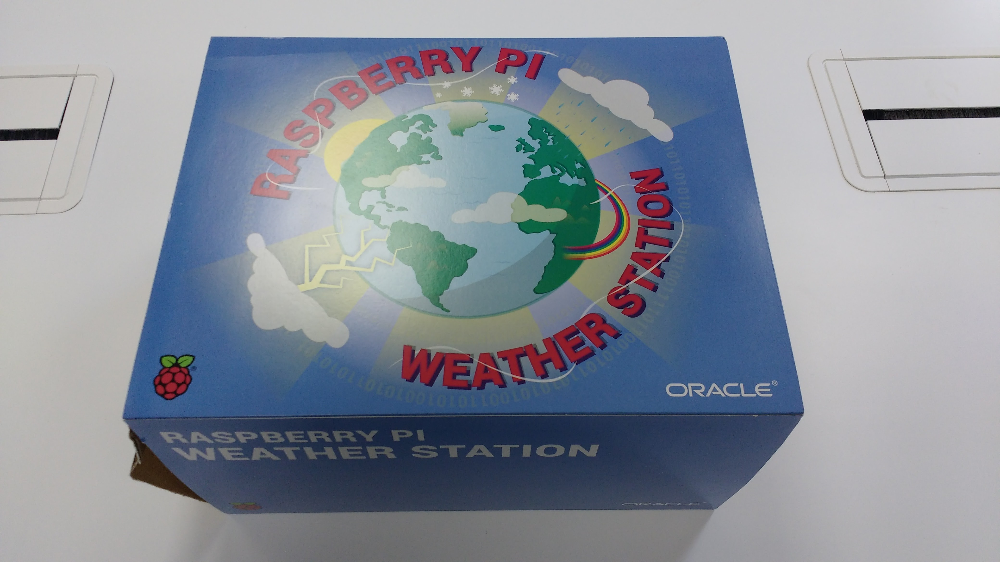
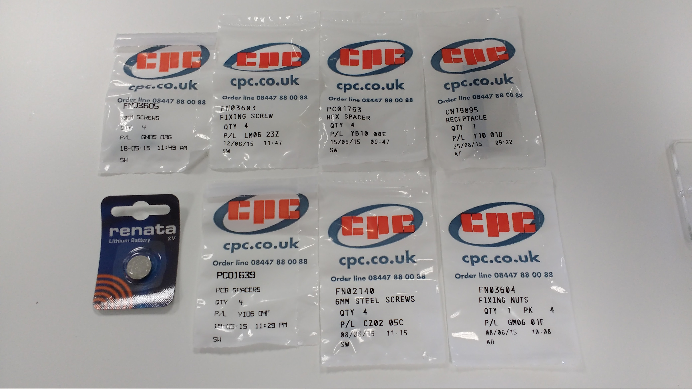
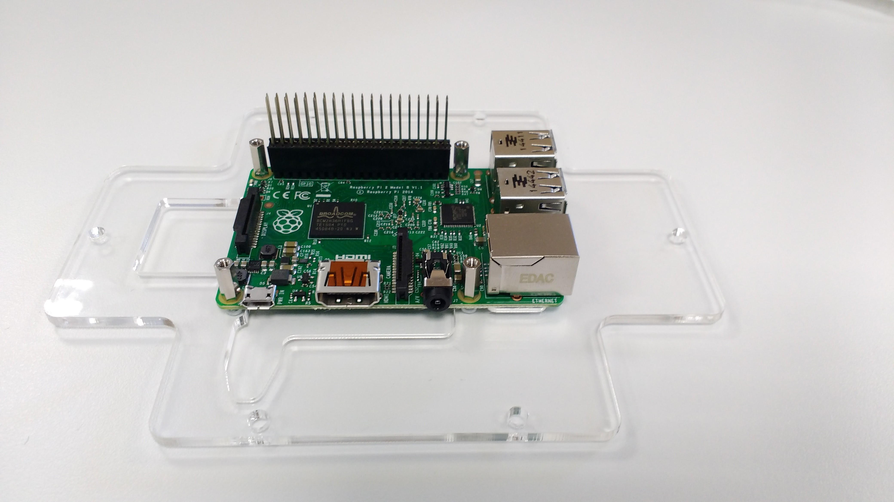
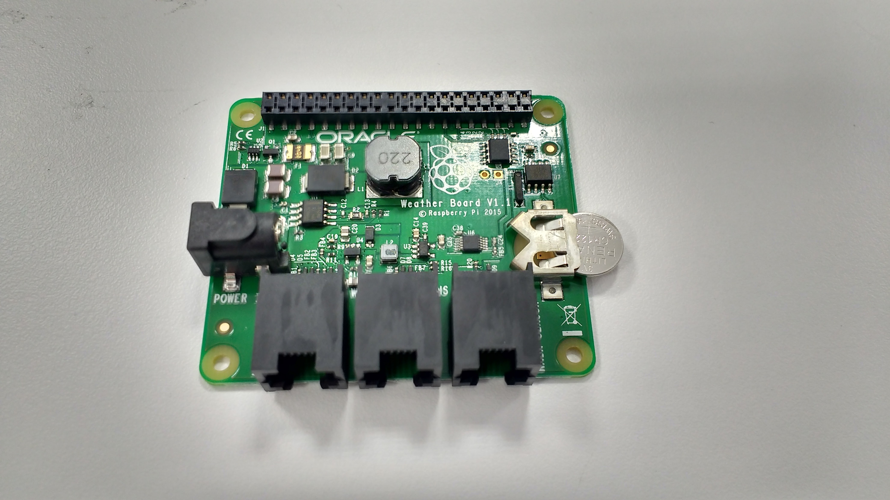
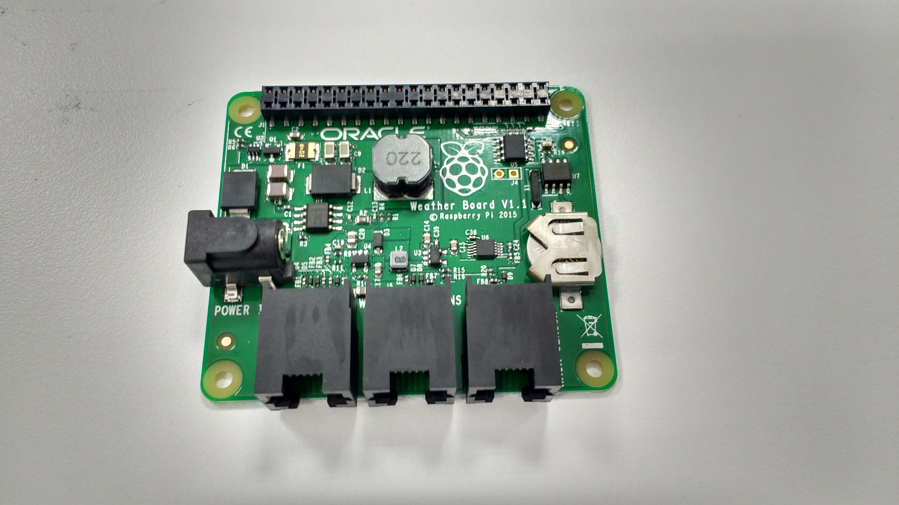
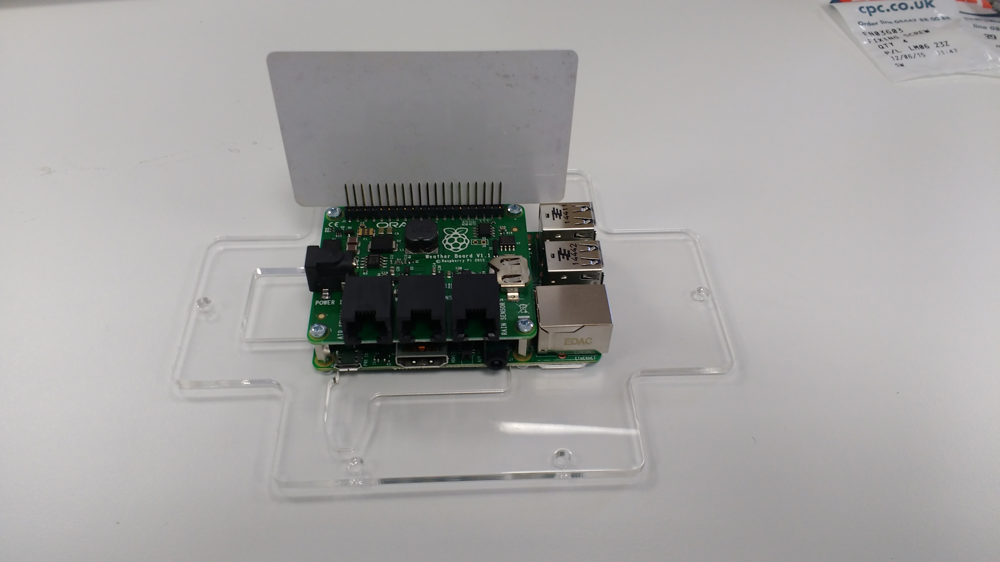
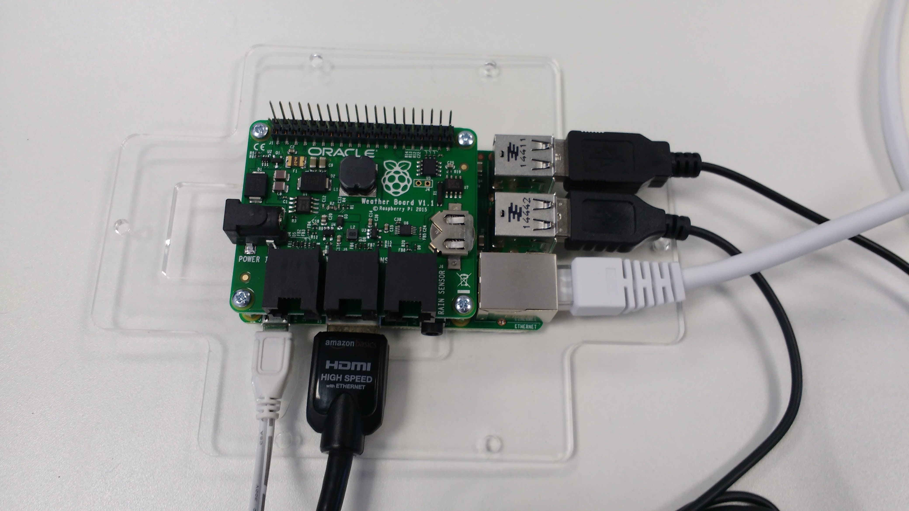
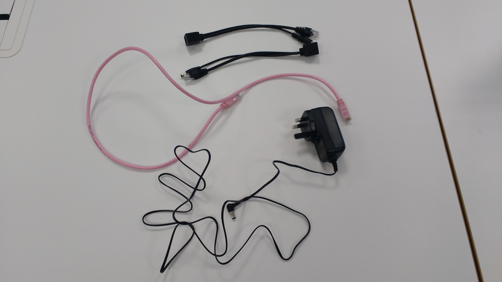

# Building your Weather Station Part I
1. Your Raspberry Pi Weather Station should arrive in a sleeved box.
   
1. Open the box and remove it's contents.
   
1. Remove the Raspberry Pi from it's box and place in onto it's acrylic base as shown below.
   
1. Remove the contents of *Board Mounting Kit*
   
1. Use the *4 x 8mm Fixing Screws* and the *4 Hex Spacers* to affix the Raspberry Pi to it's acrylic base. Then place the *CN19895 Receptacle* over the Raspberry Pi's GPIO pins.
   
1. Next take the connected *Weather board* and *Air Sensor Board*.
   
1. Use a pair of pliers to separate the two boards
   
1. Take the coin cell battery and insert it into the *Weather Board*.
   
   
1. You can now place the *Weather board* over the Raspberry Pi, making sure that the mount on the *Weather board* aligns with the pins of the *CN19895 Receptacle*.
   
1. Use the *4 x 6mm Fixing Screws* to secure the *Weather board* to the Raspberry Pi.
   
1. Use a credit card, placed between the pins on the *Receptacle* to angle each row of pins outwards a little, to ensure a good contact is made.
   
   
1. You can now plug in a keyboard, mouse, Ethernet cable, and HDMI cable to the Raspberry Pi.
   
1. To power your Raspberry Pi, you could use a standard 5V power supply or the include *Power Over Ethernet* (POE) kit.
   
1. Connect an Ethernet cable (not included) to the two POE adaptors. then plug in the power supply to the appropriate adaptor.
   
1. One adaptor plugs into the Raspberry Pi as shown below. The other end can be connected to a network point and a wall socket.
   
1. You can now proceed to the [Software Setup](), or if you prefer, you can continue to the [Building your Weather Station Part II]()
